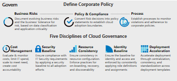

# The Five Disciplines of Cloud Governance

<!-- docutune:casing "Disciplines of Cloud Governance" "Cost Management" "Security Baseline" "Identity Baseline" "Resource Consistency" "Deployment Acceleration" -->

:::row:::
    :::column:::
        Any change to business processes or technology platforms introduces risk. Cloud governance teams, whose members are sometimes known as cloud custodians, are tasked with mitigating these risks and ensuring minimal interruption to adoption or innovation efforts.    The Cloud Adoption Framework governance model guides these decisions, irrespective of the chosen cloud platform, by focusing on [development of corporate policy](./corporate-policy.md) and the [Five Disciplines of Cloud Governance](#disciplines-of-cloud-governance). [Actionable design guides](./guides/index.md) demonstrate this model using Azure services. Learn about the disciplines of the Cloud Adoption Framework governance model below.
    :::column-end:::
    :::column:::
           *Figure 1: Visual of corporate policy and the Five Disciplines of Cloud Governance.*
    :::column-end:::
:::row-end:::

## Disciplines of Cloud Governance

With any cloud platform, there are common governance disciplines that help inform policies and align toolchains. These disciplines guide decisions about the proper level of automation and enforcement of corporate policy across cloud platforms.

| &nbsp; | &nbsp; |
|--|--|
|    |   [Cost Management](./cost-management/index.md): Cost is a primary concern for cloud users. Develop policies for cost control for all cloud platforms. |
|    |   [Security Baseline](./security-baseline/index.md): Security is a complex subject, unique to each company. Once security requirements are established, cloud governance policies and enforcement apply those requirements across network, data, and asset configurations.|
|    |   [Identity Baseline](./identity-baseline/index.md): Inconsistencies in the application of identity requirements can increase the risk of breach. The Identity Baseline discipline focuses ensuring that identity is consistently applied across cloud adoption efforts. |
|    |   [Resource Consistency](./resource-consistency/index.md): Cloud operations depend on consistent resource configuration. Through governance tooling, resources can be configured consistently to manage risks related to onboarding, drift, discoverability, and recovery. |
|    |   [Deployment Acceleration](./deployment-acceleration/index.md): Centralization, standardization, and consistency in approaches to deployment and configuration improve governance practices. When provided through cloud-based governance tooling, they create a cloud factor that can accelerate deployment activities. |
