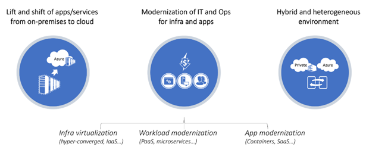

# Cloud monitoring guide: Introduction

The cloud fundamentally changes how enterprises procure and use technology resources. In the past, enterprises assumed ownership of and responsibility for all levels of technology, from infrastructure to software. Now, the cloud offers the potential for enterprises to provision and consume resources as needed.

Although the cloud offers nearly unlimited flexibility in terms of design choices, enterprises seek proven and consistent methodology for the adoption of cloud technologies. Each enterprise has different goals and timelines for cloud adoption, making a one-size-fits-all approach to adoption nearly impossible.

This digital transformation also enables an opportunity to modernize your infrastructure, workloads, and applications. Depending on business strategy and objectives, adopting a hybrid cloud model is likely part of the migration journey from on-premises to operating fully in the cloud. During this journey, IT teams are challenged to adopt and realize rapid value from the cloud. IT must also understand how to effectively monitor the application or service that's migrating to Azure, and continue to deliver effective IT operations and DevOps.

Stakeholders want to use cloud-based, software as a service (SaaS) monitoring and management tools. They need to understand what services and solutions deliver to achieve end-to-end visibility, reduce costs, and focus less on infrastructure and maintenance of traditional software-based IT operations tools.

However, IT often prefers to use the tools they've already made a significant investment in. This approach supports their service operations processes to monitor both cloud models, with the eventual goal of transitioning to a SaaS-based offering. IT prefers this approach not only because it takes time, planning, resources, and funding to switch. It's also because of confusion about which products or Azure services are appropriate or applicable to achieve the transition.

The goal of this guide is to provide a detailed reference to help enterprise IT managers, business decision makers, application architects, and application developers understand:

- Azure monitoring platforms, with an overview and comparison of their capabilities.
- The best-fit solution for monitoring hybrid, private, and Azure native workloads.
- The recommended end-to-end monitoring approach for both infrastructure and applications. This approach includes deployable solutions for migrating these common workloads to Azure.

This guide isn't a how-to article for using or configuring individual Azure services and solutions, but it does reference those sources when they're applicable or available. After you've read it, you'll understand how to successfully operate a workload by following best practices and patterns.

If you're unfamiliar with Azure Monitor and System Center Operations Manager, and you want to get a better understanding of what makes them unique and how they compare to each other, review the [overview of our monitoring platforms](./platform-overview.md).

## Audience

This guide is useful primarily for enterprise administrators, IT operations, IT security and compliance, application architects, workload development owners, and workload operations owners.

## How this guide is structured

This article is part of a series. The following articles are meant to be read together, in order:

- Introduction (this article)
- [Cloud monitoring strategy](../../strategy/monitoring-strategy.md)
- [Monitoring platform strategy for cloud deployment models](./cloud-models-monitor-overview.md)
- [Observability](./observability.md)
- [Collect the right data](./data-collection.md)
- [Alerting](./alerting.md)

## Products and services

A few software and services are available to help you monitor and manage a variety of resources that are hosted in Azure, your corporate network, or other cloud providers. They are:

- [System Center Operations Manager](/system-center/scom/welcome)
- [Azure Monitor](/azure/azure-monitor/overview) (includes Log Analytics and Application Insights)
- [Azure Policy](/azure/governance/policy/overview) and [Azure Blueprints](/azure/governance/blueprints/overview)
- [Azure Arc](/azure/azure-arc/)
- [Azure Automation](/azure/automation/automation-intro)
- [Azure Logic Apps](/azure/logic-apps/logic-apps-overview)
- [Azure Event Hubs](/azure/event-hubs/event-hubs-about)

This first version of the guide covers our current monitoring platforms: Azure Monitor and System Center Operations Manager. It also outlines our recommended strategy for monitoring each of the cloud deployment models. Also included is the first set of monitoring recommendations, starting with data collection, observability, and alerting.

## Next steps

> [!div class="nextstepaction"]
> [Monitoring strategy for cloud deployment models](./cloud-models-monitor-overview.md)
