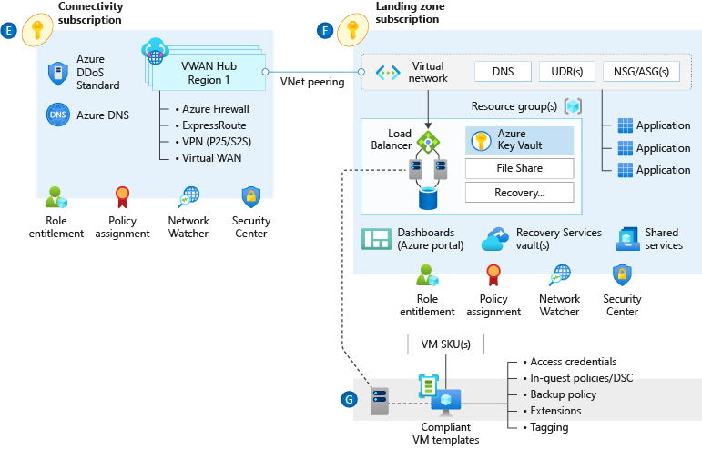
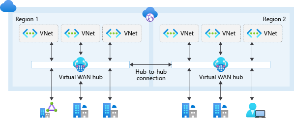
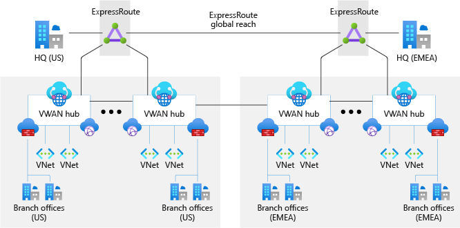

<!-- docutune:casing "Local, Standard, or Premium SKU" "ExpressRoute Standard or Premium circuits"-->

# Virtual WAN network topology (Microsoft-managed)

Explore key design considerations and recommendations surrounding virtual wide area networks (Virtual WAN) in Microsoft Azure.

*Figure 1: Virtual WAN network topology.*

**Design considerations:**

- [Azure Virtual WAN](/azure/virtual-wan/virtual-wan-about) is a Microsoft-managed solution that provides end-to-end, global, and dynamic transit connectivity by default. Virtual WAN hubs eliminate the need to manually configure network connectivity. For example, you don't need to manage user-defined routes (UDR) or network virtual appliances (NVAs) to enable global transit connectivity.

- Virtual WAN simplifies end-to-end network connectivity in Azure, and to Azure from on-premises, by creating a [hub-and-spoke network architecture](/azure/virtual-wan/virtual-wan-global-transit-network-architecture). The architecture can easily scale to support multiple Azure regions and on-premises locations (any-to-any connectivity) as shown in the following figure:

  

 *Figure 2: Global transit network with Virtual WAN.*

- Virtual WAN any-to-any transitive connectivity supports the following paths (within the same region and across regions):

  - Virtual network to virtual network
  - Virtual network to branch
  - Branch to virtual network
  - Branch to branch

- Virtual WAN hubs are restricted to the deployment of Microsoft managed resources. The only resources that you can deploy within them are virtual network gateways (Point-to-Site VPN, Site-to-Site VPN, and Azure ExpressRoute), Azure Firewall via Firewall Manager, route tables and [some network virtual appliances (NVA)](/azure/virtual-wan/about-nva-hub) for vendor-specific SD-WAN capabilities.

- Virtual WAN is bound to some [Azure subscription limits for Virtual WAN](/azure/azure-resource-manager/management/azure-subscription-service-limits#virtual-wan-limits).

- Network-to-network transitive connectivity (within a region and across regions via hub-to-hub) is now in general availability (GA).

- Transit connectivity between the virtual networks in Standard Virtual WAN is enabled due to the presence of a Microsoft-managed routing function in every virtual hub. Each hub supports an aggregate throughput of up to 50 Gbps for VNet-to-VNet traffic.

- A single Azure Virtual WAN hub can support a specific maximum number of VM workloads across all directly attached VNets, which are documented in [Azure Virtual WAN limits](/azure/azure-resource-manager/management/azure-subscription-service-limits#virtual-wan-limits).

- Virtual WAN integrates with various [SD-WAN providers](/azure/virtual-wan/virtual-wan-locations-partners).

- Many managed service providers offer [managed services](/azure/networking/networking-partners-msp) for Virtual WAN.

- User VPN (Point-to-Site) gateways in Virtual WAN can scale up to 20-Gbps aggregated throughput and 10,000 client connections per virtual hub.

- Site-to-site VPN gateways in Virtual WAN can scale up to 20-Gbps aggregated throughput.

- ExpressRoute circuits using a Local, Standard, or Premium SKU can be connected to a Virtual WAN hub.

- ExpressRoute Standard or Premium circuits that are in locations supported by ExpressRoute Global Reach can connect to a Virtual WAN ExpressRoute gateway and enjoy all Virtual WAN transit capabilities (VPN-to-VPN, VPN, and ExpressRoute transit). ExpressRoute Standard or Premium circuits that are in locations not supported by Global Reach can connect to Azure resources, but cannot use Virtual WAN transit capabilities.

- ExpressRoute Local is supported with Azure Virtual WAN hubs if the spoke VNets connected to a Virtual WAN hub are in the same region as the Virtual WAN hub.

- Azure Firewall Manager, now generally available, allows the deployment of Azure Firewall in the Virtual WAN hub, known as secured virtual hub. Review the [Azure Firewall Manager overview](/azure/firewall-manager/overview) of secured virtual hubs and the latest [constraints](/azure/firewall-manager/overview#known-issues).

- Virtual WAN hub-to-hub traffic via Azure Firewall is currently not supported when the Azure Firewall is deployed inside of the Virtual WAN hub itself (secured virtual hub). Several workarounds exist depending on your requirements, including placing the [Azure Firewall in a spoke virtual network](/azure/virtual-wan/scenario-route-through-nva), or using NSGs for traffic filtering.

- The Virtual WAN portal experience requires that all Virtual WAN resources are deployed into the same resource group together.

- An Azure DDoS Protection standard protection plan can be shared across all VNets in a single Azure AD Tenant to protect resources with public IP addresses. For more information, see [Azure DDoS Protection Standard](/azure/ddos-protection/ddos-protection-overview).

  - At this time, Virtual WAN Secure Virtual Hubs don't support Azure DDoS standard protection plans. For more information, see [Azure Firewall Manager known issues](/azure/firewall-manager/overview#known-issues) and [hub virtual network and secured virtual hub comparison](/azure/firewall-manager/vhubs-and-vnets#comparison).

  - Only resources with Public IP addresses are covered by Azure DDoS Protection standard protection plans.

    - 100 public IP addresses are included in the cost of an Azure DDoS Protection standard protection plan across all protected VNets associated to the DDoS Protection plan. Any other public IP addresses over the 100 included with the plan, are charged separately. For more information on Azure DDoS Protection Standard Protection pricing, see the [pricing page](https://azure.microsoft.com/pricing/details/ddos-protection/) or the [FAQ](/azure/ddos-protection/ddos-faq#how-does-pricing-work).
  
  - Review the [supported resources of Azure DDoS Protection standard protection plans](/azure/ddos-protection/ddos-faq#what-are-the-supported-protected-resource-types)

**Design recommendations:**

- We recommend Virtual WAN for new large or global network deployments in Azure where you need global transit connectivity across Azure regions and on-premises locations. That way, you don't have to manually set up transitive routing for Azure networking.

  The following figure shows a sample global enterprise deployment with datacenters spread across Europe and the United States. The deployment also has many branch offices within both regions. The environment is globally connected via Azure Virtual WAN and [ExpressRoute Global Reach](/azure/expressroute/expressroute-global-reach).

  

 *Figure 3: Sample network topology.*

- Use a Virtual WAN hub per Azure region to connect multiple landing zones together across Azure regions via a common global Azure Virtual WAN.

- Deploy all Virtual WAN resources into a single resource group in the connectivity subscription, including when you are deploying across multiple regions.

- Use [virtual hub routing](/azure/virtual-wan/about-virtual-hub-routing) features to further segment traffic between VNets and branches.

- Connect Virtual WAN hubs to on-premises datacenters by using ExpressRoute.

- Deploy required shared services, like DNS servers, in a dedicated spoke virtual network. Customer deployed shared resources cannot be deployed inside the Virtual WAN hub itself.

- Connect branches and remote locations to the nearest Virtual WAN hub via Site-to-Site VPN, or enable branch connectivity to Virtual WAN via an SD-WAN partner solution.

- Connect users to the Virtual WAN hub via a Point-to-Site VPN.

- Follow the principle of "traffic in Azure stays in Azure" so that communication across resources in Azure occurs via the Microsoft backbone network, even when the resources are in different regions.

- For internet outbound protection and filtering, consider deploying Azure Firewall in the virtual hub.

- If partner NVAs are required for east/west or south/north traffic protection and filtering, as Azure Virtual WAN doesn't allow deploying such security NVAs in the virtual hub, evaluate whether deploying those NVAs to a separate spoke virtual network and configuring static routing as described in [Scenario: Route traffic through an NVA](/azure/virtual-wan/scenario-route-through-nva) will meet your requirements. As an alternative, consider a traditional network topology based on the hub and spoke model, as partner NVAs can be deployed in a regular hub virtual network.

- When you're deploying partner networking technologies and NVAs, follow the partner vendor's guidance to ensure there are no conflicting configurations with Azure networking.

- For brownfield scenarios where you're migrating from a hub-and-spoke network topology not based on Virtual WAN, see [Migrate to Azure Virtual WAN](/azure/virtual-wan/migrate-from-hub-spoke-topology).

- Create Azure Virtual WAN and Azure Firewall resources within the connectivity subscription.

- Don't create more than 500 virtual network connections per Virtual WAN virtual hub.

  - If more than 500 virtual network connections per Virtual WAN virtual hub are required, deploy an additional Virtual WAN virtual hub in the same region as part of the same Virtual WAN and same resource group.

- Plan your deployment carefully, and ensure that your network architecture is within the [Azure Virtual WAN limits](/azure/azure-resource-manager/management/azure-subscription-service-limits#virtual-wan-limits).

- Use [insights in Azure Monitor for Virtual WAN (preview)](/azure/virtual-wan/azure-monitor-insights) to monitor the end-to-end topology of your Virtual WAN and status and [key metrics](/azure/virtual-wan/azure-monitor-insights#detailed).

- Deploy a single Azure DDoS standard protection plan in the connectivity subscription.

  - All landing zone and platform VNets should use this plan.
