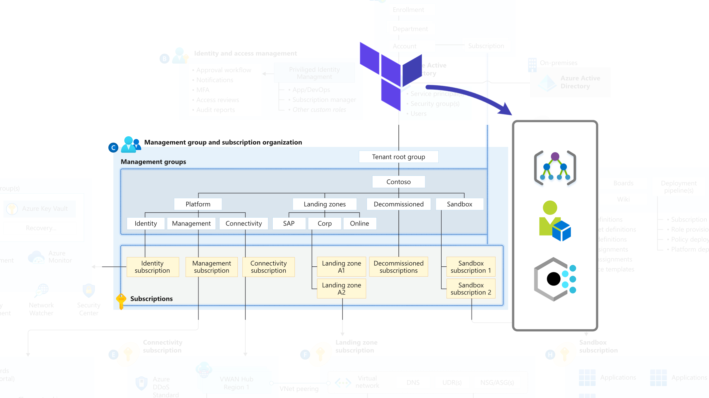

# Terraform module for Cloud Adoption Framework enterprise-scale

Azure provides native services for deploying your landing zones. Other third-party tools can also help with this effort. One such tool that customers and partners often use to deploy landing zones is Terraform by HashiCorp.

This section shows how to use the official [Terraform module for Cloud Adoption Framework enterprise-scale](https://registry.terraform.io/modules/Azure/caf-enterprise-scale/azurerm/latest) to accelerate your journey to managing Azure landing zones at scale using Terraform.

## Purpose of enterprise-scale landing zones

The [Terraform Module for Cloud Adoption Framework enterprise-scale](https://registry.terraform.io/modules/Azure/caf-enterprise-scale/azurerm/latest) provides a simplified approach for deploying the [Management Group and Subscription organization](./management-group-and-subscription-organization.md) hierarchy from the enterprise scale [reference architecture](./architecture.md#high-level-architecture) using Terraform, enabling:

1. Managed resource hierarchy for *subscription* organization using *management groups*.
1. A scalable security and governance model using *Azure Policy* and *Access Control (IAM)*, with an extensive library of custom definitions ready to assign.
1. Enforced security and governance settings across *subscriptions* through *management group* inheritance.

By packaging these capabilities into a single Terraform module, it becomes easier to build and enforce consistency across the Azure platform when operating at scale.

## Use standard modules

Reuse of components is a fundamental principle of infrastructure as code. Modules are instrumental in defining standards and consistency across resource deployment within and across environments. This module is published to the official [Terraform registry](https://registry.terraform.io/modules/Azure) and is verified by HashiCorp.

## Architecture diagram

The [Terraform module for Cloud Adoption Framework enterprise-scale](https://registry.terraform.io/modules/Azure/caf-enterprise-scale/azurerm/latest) deploys the following components from the enterprise scale [reference architecture](./architecture.md#high-level-architecture):


*Figure 1: Overview of resources deployed by the Terraform module for Cloud Adoption Framework enterprise-scale.*

## Capabilities

The components deployed and their purpose include the following:

| Component | Responsibility |
|---|---|
| Management groups | Core management groups provide the resource hierarchy foundations of the enterprise-scale reference architecture: <li> Optional management groups for demo landing zones (SAP, corp and online) <li> Optional management groups for custom landing zones (define your own) |
| Azure Policy | Azure Policy to provide security and governance across the platform: <li> Custom policy definitions and policy set definitions to cover common governance patterns not covered by the built-in policies <li> Create and assign policies at any scope within the management group hierarchy to ensure compliance is enforced through inheritance <li> Expand with your own custom definitions to meet your specific security and governance requirements </li> |
| Access control (IAM) settings | Create and assign roles in the resource hierarchy to ensure compliance with RBAC policies: <li> Create custom role definitions to ensure principle of least privilege <li> Create role assignments at the right scope to ensure platform and application teams have the right permissions |
| Subscriptions | Subscriptions are assigned to management groups: <li> Enables policy and RBAC inheritance <li> Ensures compliance with platform security and governance requirements |

## Customize and deploy

To simplify getting started with this module, it has been published to the [Terraform registry](https://registry.terraform.io/modules/Azure). This allows you to consume it directly from the registry as a re-usable module and can benefit from updates as they get released.

The only dependencies for this module are as follows:

- Terraform (*recommended version 0.13.2 and later*)
- AzureRM provider (*recommended version 2.34.0 and later*)

> [!IMPORTANT]
> There are known issues with some Terraform and AzureRM provider version combinations. Some of these are due to new bugs being introduced which have since been remediated, whilst others are transient errors which can typically be resolved by re-running your deployment. We generally recommend pinning to specific versions, and testing thoroughly before upgrading. As each new version of the module is released, the project team plan to rebase the module to ensure compatibility with the latest Terraform and AzureRM provider versions.

### Simple example

The following is a simple starting configuration for your `main.tf` root module:

> [!TIP]
> Although the module has only one mandatory variable `root_parent_id`, we also recommend setting `root_id`. Changing the `root_id` value will initiate a full redeployment of all resources managed by the module, including downstream dependencies.

```hcl

# We strongly recommend using the required_providers block to set the
# Azure Provider source and version being used.

terraform {
  required_providers {
    azurerm = {
      source  = "hashicorp/azurerm"
      version = ">= 2.46.1"
    }
  }
}

provider "azurerm" {
  features {}
}

# You can use the azurerm_client_config data resource to dynamically
# extract the current Tenant ID from your connection settings.

data "azurerm_client_config" "current" {
}

# Call the caf-enterprise-scale module directly from the Terraform Registry
# pinning to the latest version

module "enterprise_scale" {
  source  = "Azure/caf-enterprise-scale/azurerm"
  version = "0.1.0"

  root_parent_id = data.azurerm_client_config.current.tenant_id
  root_id        = "demo"

}
```

This example code will deploy the minimum recommended [management group and subscription organization](./management-group-and-subscription-organization.md) from the enterprise-scale reference architecture. You can then start to customize your deployment once you've got this up and running.

> [!TIP]
> If you are new to Terraform, refer to this [tutorial on HashiCorp Learn](https://learn.hashicorp.com/tutorials/terraform/install-cli?in=terraform/azure-get-started), covering installation and use of Terraform, and the [AzureRM provider guides](https://registry.terraform.io/providers/hashicorp/azurerm/latest/docs#authenticating-to-azure) for information on how to configure the provider and authenticate with Azure.

## Next steps

The Terraform module for Cloud Adoption Framework enterprise-scale provides an accelerated path to building out your enterprise-scale landing zones. It also provides a great deal of flexibility to expand and customize your deployment whilst retaining a simplified approach to managing the configuration of each landing zone.

To find out more, review the module on Terraform registry, and explore the [GitHub wiki](https://github.com/Azure/terraform-azurerm-caf-enterprise-scale/wiki) where we will post more examples and tutorials covering how to customize your deployment.

> [!div class="nextstepaction"]
> [Review the module on Terraform registry](https://registry.terraform.io/modules/Azure/caf-enterprise-scale/azurerm/latest)
