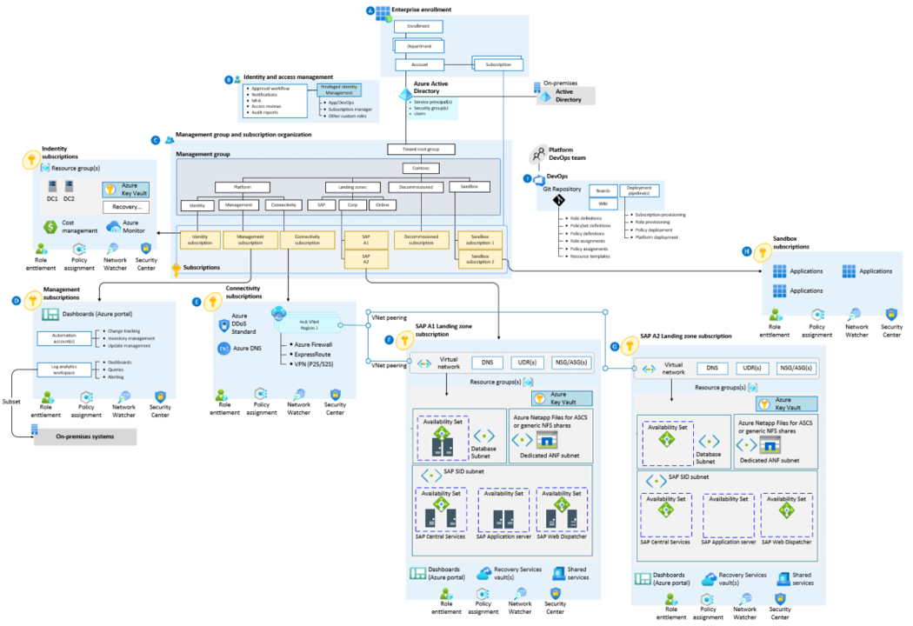
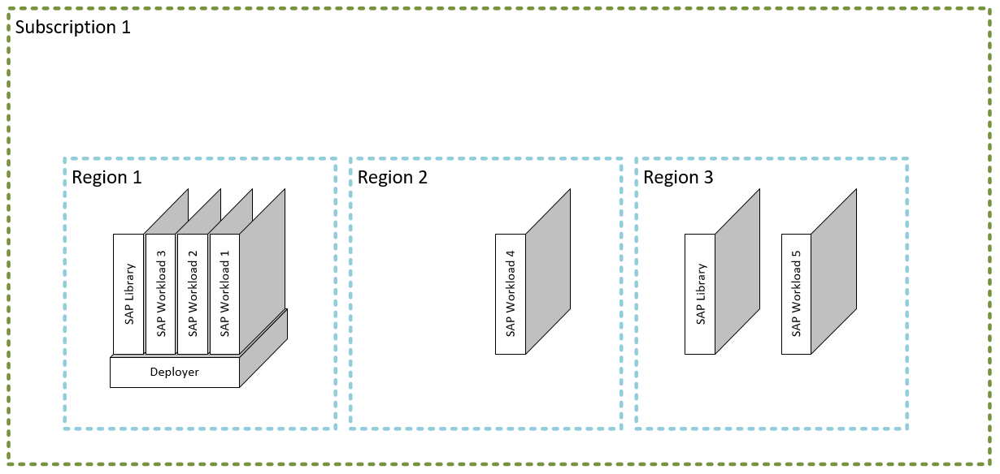

# Enterprise-scale for SAP on Azure

Enterprise-scale for SAP on Azure provide specific architectural approach and reference implementation that enables effective construction and operationalization of platform workload landing zones within the Cloud Adoption Framework enterprise-scale landing zone. After you have successfully implemented an enterprise-scale landing zone, they can use enterprise-scale for SAP on Azure. Review the enterprise-scale [overview](../../ready/enterprise-scale/index.md) and [implementation guidance](../../ready/enterprise-scale/implementation.md) before deploying enterprise-scale for SAP on Azure.

## Adopt enterprise-scale for SAP on Azure

Not all customers adopt SAP on Azure in the same way. The enterprise-scale for SAP on Azure architecture varies between customers. The technical considerations and design recommendations of enterprise-scale for SAP on Azure might lead to different trade-offs based on your organization's scenario. If you follow the core recommendations, the resulting architecture sets your organization on a path to a sustainable scale. The enterprise-scale for SAP on Azure is modular by design. You can customize environmental variables. This solution approach to landing zones includes three sets of assets to support cloud teams:

- [Design guidelines](#design-guidelines)
- [Architecture](#architecture)
- [Implementation](#implementation)

## Design guidelines

You have to make critical decisions that drive the design of the Cloud Adoption Framework for Azure enterprise-scale landing zone. Consider these six critical design areas:

- [Identity and access management](./eslz-identity-and-access-management.md)
- [Network topology and connectivity](./eslz-network-topology-and-connectivity.md)
- [Management and monitoring](./eslz-management-and-monitoring.md)
- [Business continuity and disaster recovery](./eslz-business-continuity-and-disaster-recovery.md)
- [Security, governance, and compliance](./eslz-security-governance-and-compliance.md)
- [Platform automation and DevOps](./eslz-platform-automation-and-devops.md)

## Architecture

The following image shows a conceptual reference architecture that demonstrates design areas:

## Implementation

The **SAP on Azure deployment automation framework** is a collection of processes combined with a flexible workflow. The [SAP deployment automation framework repository](https://github.com/Azure/sap-hana) has code that automatically deploys SAP landscapes in the Azure cloud.

The templates are split into two categories:

- Terraform modules deploy the infrastructure components in Azure:
  - VMs
  - Network
  - Storage
- Ansible playbooks run different roles to:
  - Set up and deploy VMs
  - Install SAP HANA
  - Install other required applications

Deploy and install the Ansible playbook components on the infrastructure that the Terraform modules built.

## Next steps

Review the design areas of enterprise-scale for SAP on Azure that are critical to making complete considerations and recommendations for your enterprise-scale for SAP on Azure architecture:

- [Identity and access management](./eslz-identity-and-access-management.md)
