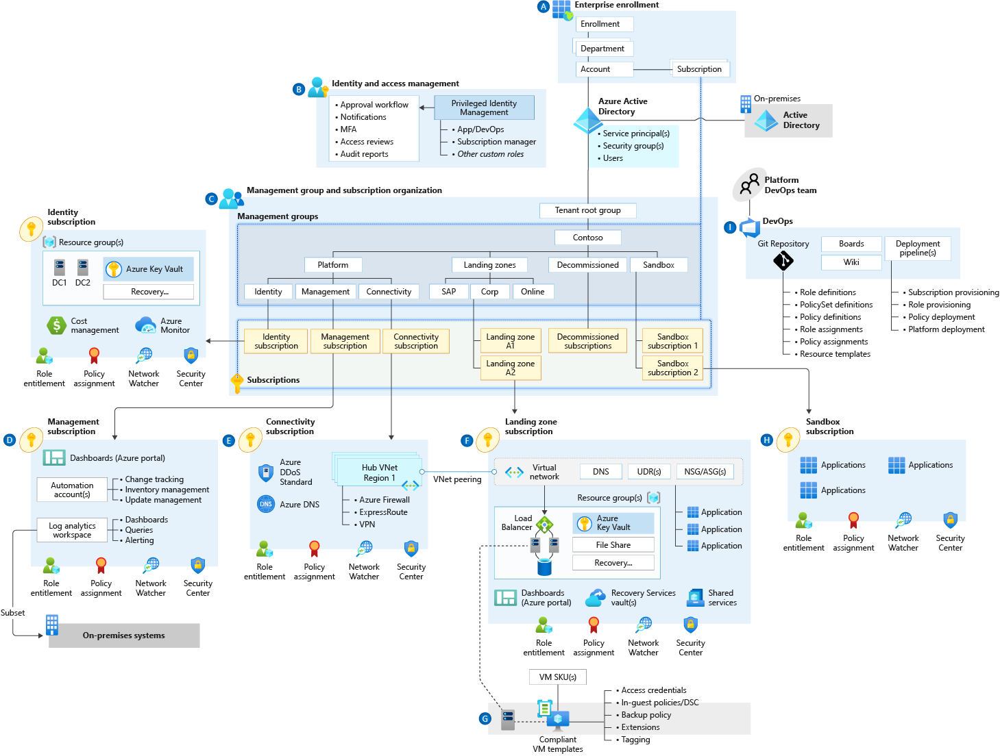

# Azure landing zone for an SAP on Azure

The [Ready methodology in the Cloud Adoption Framework](../../ready/index.md) guides the creation of all Azure environments using [Azure landing zones](../../ready/landing-zone/index.md). Azure landing zones provide many [implementation options](../../ready/landing-zone/implementation-options.md) built around a set of [common design areas](../../ready/landing-zone/design-areas.md).

With Azure landing zones, you can start with a small implementation and expand over time. For more sophisticated environments, you can start with enterprise-scale implementation options, which will include operations, security, and governance services in the initial environment.

## Azure landing zone conceptual architecture

When preparing any environment for sustained cloud adoption, we use the [Azure landing zones](../../ready/landing-zone/index.md) conceptual architecture to represent what a target end state should look like in Azure, as pictured below.

When developing a long-term vision for landing zones, consider the design above. Working within this scenario, we focus on the most appropriate starting point to meet your strategic and planning requirements for SAP on Azure. This article is about the starting point, not necessarily all of the details required to reach the longer term target.

## Strategic & planning considerations for SAP landing zones

Prioritization decisions made during [strategy](./strategy.md) and [plan](./plan.md) conversations will have a direct impact on the most appropriate landing zone configuration to support your SAP plan. The following are the most important considerations from those phases:

- Will the initial deployment require mature processes for operations, security, and governance prior to launch?
- Alternatively, does the adoption plan require a smaller initial instance of SAP for POC, development, or testing efforts on a shorter timeline?

These questions will have a direct impact on implementation options.

## Implementation option considerations

Selecting the best Azure landing zone implementation option will have a direct impact on how well the landing zone(s) can support the implementation options above. For more information on Azure landing zone implementation options, review the [Azure landing zones](../../ready/landing-zone/index.md) article series. Which of the Azure landing zone implementation options best addresses the strategy & planning considerations governing your SAP adoption scenario?

- **Existing Azure landing zone strategy:** If your organization has already implemented an Azure landing zone strategy, it is likely that your SAP adoption scenario will need to adhere to the existing strategy. Otherwise, choose one of the following options as your first step towards repeatable landing zone environments.
- **Start-small and expand with SAP HANA Scale-up on Linux:** The [reference architecture for SAP HANA Scale-up on Linux](/azure/architecture/reference-architectures/sap/run-sap-hana-for-linux-virtual-machines?bc=/azure/cloud-adoption-framework/_bread/toc.json&toc=/azure/cloud-adoption-framework/scenarios/sap/toc.json) provides a proven approach to deploying a small SAP HANA platform. Before promoting this smaller environment to production, organizations should complete the Govern and Manage methodologies of CAF to ensure that the environment is ready for mission-critical workload support.
- **Enterprise-scale landing zones:** [Enterprise-scale for SAP](./enterprise-scale-landing-zone.md) deploys a more comprehensive reference architecture based on [SAP HANA on Azure (Large Instances)](/azure/architecture/reference-architectures/sap/hana-large-instances?bc=/azure/cloud-adoption-framework/_bread/toc.json&toc=/azure/cloud-adoption-framework/scenarios/sap/toc.json), but within the specific environmental configuration required by the broader enterprise-scale landing zone solutions. This is the fastest path to reach a production ready environment, which includes tooling for operations, security, and governance.

The primary difference between the two options above resides in how separation of duties is expressed and implemented in terms of Azure resources, subscription topology, and usage of Azure Policy for governance. Understand your organization's plan around centralized versus decentralized operations and which work best for your organization's workloads. Both models can be flexed to provide the exact experience your organization and workloads require, but you'll want to start with the one most closely aligned with your defined strategy. Ensure all workload teams understand the operating model and duties required of all IT groups and members.

## Azure landing zone design areas

Regardless of your initial implementation option, all Azure landing zones for SAP should adhere to a set of common design considerations and recommendations outlined in the following articles series. These checklists of considerations and recommendations can help the SAP team evaluate any landing zone to ensure it is ready to host the SAP platform in production:

- [Enterprise enrollment](eslz-enterprise-enrollment.md)
- [Identity and access management](eslz-identity-and-access-management.md)
- [Network topology and connectivity](eslz-network-topology-and-connectivity.md)
- [Resource Organization](eslz-resource-organization.md)
- [Governance disciplines](eslz-security-governance-and-compliance.md)
- [Operations baseline](eslz-management-and-monitoring.md)
- [Business continuity and disaster recovery](eslz-business-continuity-and-disaster-recovery.md)
- [Deployment options](eslz-platform-automation-and-devops.md)

## Next step: Migrate an SAP platform to Azure

The following articles provide guidance for specific points throughout the cloud adoption journey to help you succeed in adopting SAP in Azure.

- [Migrate an SAP platform to Azure](./migrate.md)
- [Innovate with SAP](./innovate.md)
- [Manage SAP](./manage.md)
